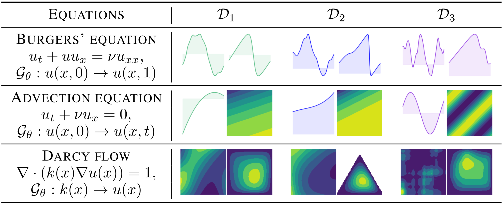
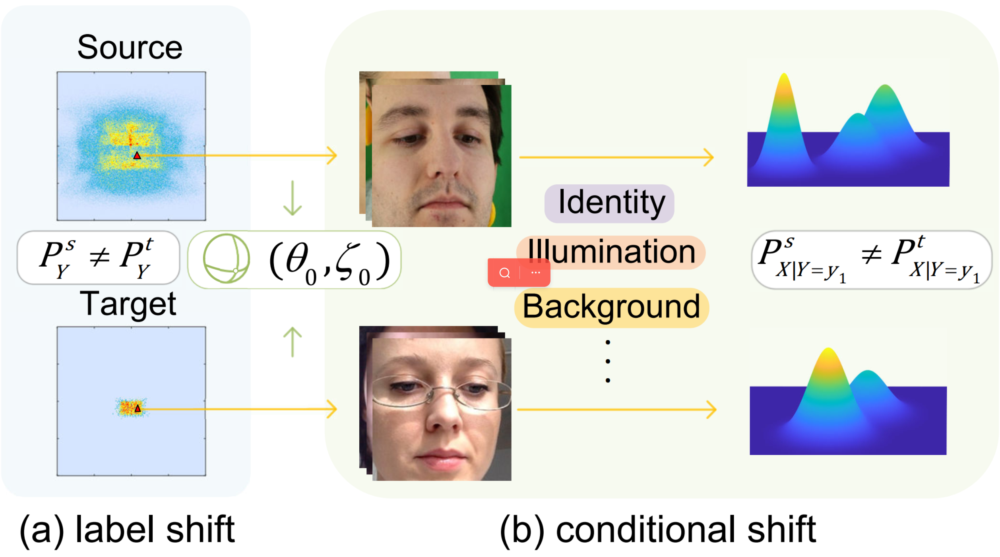
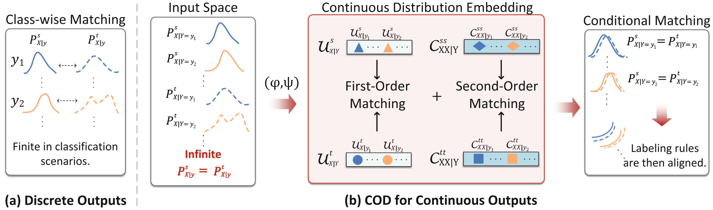








Hi! I'm Hao-Ran Yang (officially, Haoran Yang), a third-year master's student in the School of Mathematics at Sun Yat-sen University (SYSU), where I also completed my bachelor's degree. My research interests lie in applied mathematics and machine learning. I am particularly interested in how prior knowledge can be mathematically modeled and integrated into the design, training, and adaptation of models. 

I am always open to research collaborations and internship opportunities—please feel free to drop me an email if you are interested in working with me.   

Beyond academics, I am passionate about orienteering. As a student-athlete on SYSU's orienteering team, I have represented the school in Chinese Orienteering Championship and other major competitions. I deeply enjoy the process of reading maps, exploring the unknown, and reaching checkpoints, which gives me a unique sense of freedom and accomplishment.

# 🔥 News
- *2025.09*: Two papers are accepted by NeurIPS 2025. 
- *2024.07*: One paper is accepted by ECCV 2024 as oral paper. 

# 📝 Publications 

NeurIPS 2025

[A Physics-preserved Transfer Learning Method for Differential Equations](https://arxiv.org/pdf/2505.01281)

**Hao-Ran Yang**, Chuan-Xian Ren

NeurIPS 2025

[A Generalized Label Shift Perspective for Cross-Domain Gaze Estimation](https://arxiv.org/pdf/2505.13043)

**Hao-Ran Yang**, Xiaohui Chen, Chuan-Xian Ren

ECCV 2024 **oral**

[COD: Learning Conditional Invariant Representation for Domain Adaptation Regression](https://arxiv.org/pdf/2408.06638?)

**Hao-Ran Yang**, Chuan-Xian Ren, You-Wei Luo

# 🎖 Honors and Awards
- *2023.09* First Prize of Outstanding Student Scholarship of Sun Yat-sen University
- *2023.08* Eight place of Chinese Student Orienteering Championship, Men’s Group A

# 📖 Educations
- *2023.09 - 2026.06 (now)*, M.S. in School of Mathematics, Sun Yat-Sen University
- *2019.09 - 2023.06*, B.S. in School of Mathematics, Sun Yat-Sen University
